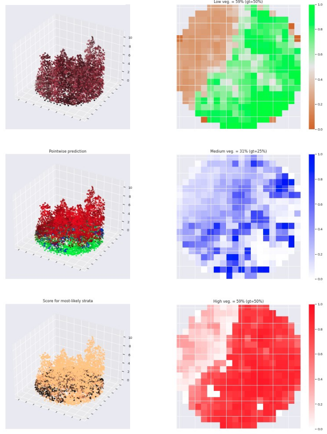

# PointNet2-based model for the prediction of vegetation coverage using 3D LiDAR point clouds

PyTorch implementation of a weakly supervised algorithm for the prediction of vegetation coverage of different stratum. The algorithm is based on [PointNet2](https://arxiv.org/abs/1706.02413) for 3D data classification and segmentation.

The model takes raw, unordered set of LiDAR points and computes for each point the pointwise probability of membership to one of four following class:
- bare soil
- low vegetation
- medium vegetation
- high vegetation

Alongside, the model computes a fifth value in the 0-1 range, which is interpreted as a density. This density is then multiplied with membership probabilities to yield pointwise coverage predictions for all three vegetation strata. Note: the bare soil probability is ignored, but is important to have a proper definition of membership probabilities. 

Finally, pointwise coverages values are max-projected on each stratum, which yields four 2D rasters of vegetation coverage values. The average value of each raster then gives the coverage value for the area of interest.

The model is applied to circular, 10m radius plots. With pointwise classification and coverage map generation, one can expain predictions.  

### Requirements
This project lives in an environment with python 3.7.11 and pytorch 1.8.0. Modules [torch_scatter](https://github.com/rusty1s/pytorch_scatter) and [torch_geometric](https://github.com/rusty1s/pytorch_geometric) are also required. Their installation can be challenging, due to multiple possible combinations of CUDA and torch versions. 

Use the `setup_env.sh` script to create a conda environment with all fixed python dependencies automatically.

This project requires GDAL library for geographic data manipulation, which can be installed following this [recipe](https://mothergeo-py.readthedocs.io/en/latest/development/how-to/gdal-ubuntu-pkg.html).

## Example results

### Plot-level interpretation

Keys:
- Left
  1. LiDAR point cloud, visualized in fake colors to highlights vegetation (Near Infrared+Red+Green as RGB channels)
  2. LiDAR point cloud showing pointwise class membership (probabilities of class membership as RGB channel
  3. LiDAR point cloud showing pointwise class probability for most likely strata based on an explicit strata-likelihood modelling used in training regularization.
- Right - "gt" stands for Ground Truth, to which predicted values are contrasted
  1. Raster of low vegetation coverage
  2. Raster of medium vegetation coverage
  3. Raster of high vegetation coverage

