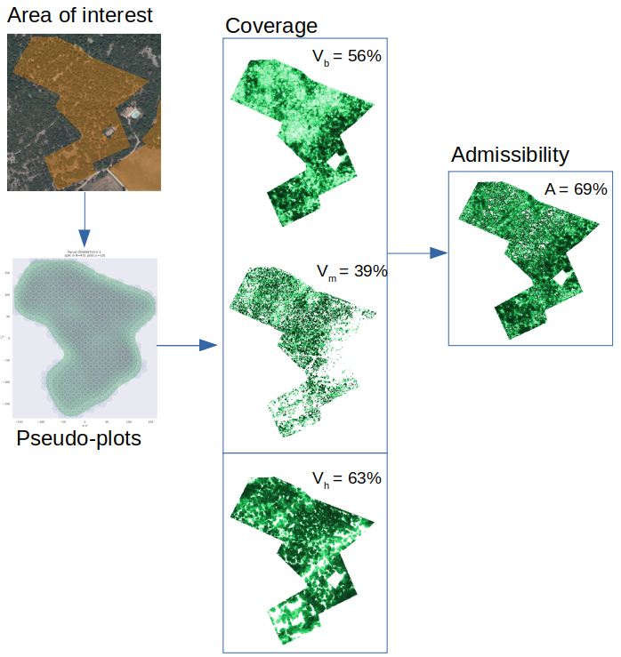

# PointNet2-based model for the prediction of vegetation coverage using 3D LiDAR point clouds

  * [What is it?](#what-is-it-)
  * [What do results look like?](#what-do-results-look-like-)
  * [What happens in the PointNet2-based model?](#what-happens-in-the-pointnet2-based-model-)
  * [How to make it run?](#how-to-make-it-run-)

## What is it?
This repository includes:
- PyTorch implementation of a weakly supervised algorithm for the prediction of maps of vegetation coverage for different vegetation strata. The algorithm is based on [PointNet2](https://arxiv.org/abs/1706.02413) for 3D data classification and segmentation.
- Interpretation tools for predictions, in the form of visualizations of intermediary scores and maps of the model.
- Inference tools, to make predictions at scale, for areas of arbitrary shapes, including data preparation, batched-inference, and fusion of local maps into a global map of vegetation coverage. 

This work stems from and extends the following research project: [ekalinicheva/plot_vegetation_coverage](https://github.com/ekalinicheva/plot_vegetation_coverage).

## What do results look like?

### Parcel level inference steps

### Plot-level results interpretation figure
Plot-level predictions on evaluation data during cross-validation are interpreted with the following figures, which helps gain confidence into how the model identify vegetation:

Keys:
- Left
  1. LiDAR point cloud, visualized in fake colors to highlights vegetation (Near Infrared+Red+Green as RGB channels)
  2. LiDAR point cloud showing pointwise class membership (probabilities of class membership as RGB channel
  3. LiDAR point cloud showing pointwise class probability for most likely strata based on an explicit strata-likelihood modelling used in training regularization. Black indicates deviation from the explicit model.
- Right - "gt" stands for Ground Truth, i.e. the target label, to which predicted values are compared:
  1. Raster of low vegetation coverage
  2. Raster of medium vegetation coverage
  3. Raster of high vegetation coverage

## What happens in the PointNet2-based model?

Inference is highly structured to make predictions more logical and interpretable, which improves generalization capabilities. 

The model takes raw, unordered set of LiDAR points and computes for each point the pointwise probability of membership to one of four following class:
- bare soil
- low vegetation
- medium vegetation
- high vegetation

Alongside, the model computes a fifth value in the 0-1 range, which is interpreted as a density. This density is then multiplied with membership probabilities to yield pointwise coverage predictions for all three vegetation strata. Note: the bare soil probability is ignored, but is important to have a proper definition of membership probabilities. 

Finally, pointwise coverages values are max-projected on each stratum, which yields four 2D rasters of vegetation coverage values. The average value of each raster then gives the coverage value for the area of interest.

The model is applied to circular, 10m radius plots. With pointwise classification and coverage map generation, individual predictions can be explained.

## How to make it run?

### Requirements
This project lives in an environment with python 3.7.11 and pytorch 1.8.0. Modules [torch_scatter](https://github.com/rusty1s/pytorch_scatter), [torch_geometric](https://github.com/rusty1s/pytorch_geometric) and [torch_cluster](https://github.com/rusty1s/pytorch_cluster) are also required.

Use the `setup_env.sh` script to create a conda environment with all fixed python dependencies automatically for cuda 1.1.1.

This project requires GDAL library for geographic data manipulation, which can be installed following this [recipe](https://mothergeo-py.readthedocs.io/en/latest/development/how-to/gdal-ubuntu-pkg.html).

[Comet.ml](comet.ml) was used to track experiments. If you do not need it, simply add parameter `--disabled` when running the code.

### Commands

File `config.py` specify all relevant parameters than can be modified when running the code. Parameters relative to locations to input data should be specified. CUDA support for PytTorch is enabled with `--cuda x` (where x is the GPU index). All logs are saved in a required `./experiments/` folder.

Model training and evaluation are performed with cross-validation in `python main.py [...]`. They require to specify the following arguments:
- `--las_plots_folder_path`: A folder of .las files with a unique identifiers as filename, whose features are specified in `utils.load_data.load_las_file` and named via `--input_feats`.
- `--gt_file_path`/`--corrected_gt_file_path` The .csv files with the target labels in the 0-100 range (%), whose columns are the ones defined in `utils.load_data.load_ground_truths_dataframe`. If you do not need to use corrected target labels that are different from original labels, use the same .csv file for both. 

The inference is two-steps:
  - Preparation of parcel data: `python prepare.py [...]`
  - Prediction of parcel data: `python predict.py --task inference [...]`

and requires to specify the following arguments:
- `--las_parcels_folder_path`: a folder, which has a subfolder named `input` which contains the .las files with a unique identifiers as filename. Note: the .las files should include points within a 20m buffer of the parcel, to avoid border-effects.
- `--parcel_shapefile_path`: a shapefile, with a shape per parcel, with a shape ID corresponding to its .las filename.
- `--inference_model_id`: the experiment id of a pytorch-saved model .pt checkpoint saved by `model.point_net2.PointNet2.save_state`. The .pt model can have arbitrary name but must contains the "full" keyword (e.g. "my_full_model.pt"), and be stored in ./experiments/.../{inference_model_id}/ folder.  

Prepared data (.pkl) is stored in `{las_parcels_folder_path}/prepared/`. Predicted maps (.tiff) and a shapefile updated with the parcel-level predictions are stored in `{las_parcels_folder_path}/inference/{inference_model_id}/`, including small plot-level maps in subfolders.
